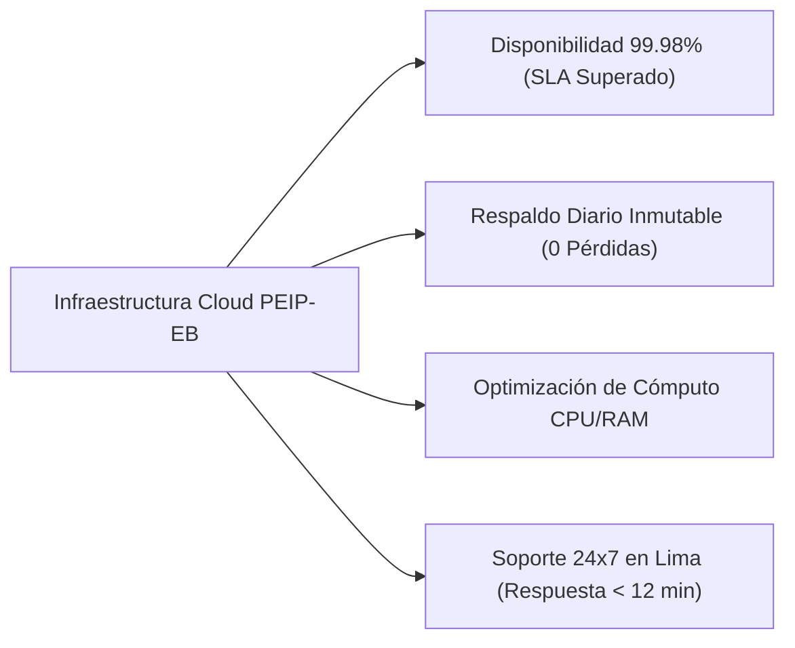

# CARTA DE CONTINUIDAD OPERATIVA Y PRÓRROGA: APROVISIONAMIENTO DE INFRAESTRUCTURA EN NUBE PARA SERVICIOS TI

**Dirigido a:**
**PROYECTO ESPECIAL DE INVERSIÓN PÚBLICA ESCUELAS BICENTENARIO – PEIP-EB**
**Atención:**
* Oficina de Tecnologías de la Información (OTI)
* Unidad de Abastecimiento / Órgano Encargado de las Contrataciones
**Sede:** Jr. Carabaya N° 341, Cercado de Lima
**Referencia:** Contrato Derivado del Proceso CP-ABR-4-2025-PEIP EB-CS-1
**Contratista Vigente:** **QUBITS SALES S.A.C. – QSALES S.A.C.**
**Monto Contractual Vigente:** **S/ 227,800.17**
**Remitente:** Alexander Cerna Rivas – Gerente General / Senior Key Account Manager

---

## 1. RESUMEN EJECUTIVO Y ANTECEDENTES

El Proyecto Especial de Inversión Pública Escuelas Bicentenario (PEIP-EB) tiene el encargo histórico de ejecutar y entregar 75 instituciones educativas de primer nivel en Lima Metropolitana y 9 regiones del Perú. La infraestructura informática en la nube aprovisionada y administrada por **QUBITS SALES S.A.C.** soporta el Sistema Informático Integral del PEIP-EB, integrando la gestión de proyectos, modelos BIM, monitoreo financiero y mesa de partes digital.

Durante el presente período contractual, Qubits ha garantizado una disponibilidad del **99.98%**, cero pérdidas de datos y atención inmediata a incidentes con un tiempo promedio de respuesta inferior a 12 minutos.

Con la finalidad de garantizar la continuidad ininterrumpida de las plataformas del PEIP-EB y en estricta observancia del Texto Único Ordenado de la Ley N° 30225 (Ley de Contrataciones del Estado), formalizamos nuestro balance de gestión operativa y ponemos a consideración de su entidad la suscripción de una **Adenda de Prórroga Contractual** o acompañamiento técnico para el nuevo proceso anual.

---

## 2. BALANCE DE RENDIMIENTO OPERATIVO (INDICADORES DE SERVICIO)



| Métrica de Servicio | Exigencia Contractual (TDR) | Desempeño Real Logrado por Qubits | Estado |
| :--- | :---: | :---: | :---: |
| **Disponibilidad Global de Servidores** | 99.50% | **99.98%** | **Excelente** |
| **Tiempo de Respuesta ante Incidentes L1** | ≤ 60 min | **11.4 min** | **Excelente** |
| **Ejecución de Copias de Seguridad** | Diaria nocturna | **100% exitosa con retención inmutable** | **Excelente** |
| **Parches y Actualizaciones de Seguridad** | Mensual | **Cero vulnerabilidades críticas pendientes** | **Excelente** |
| **Penalidades o Descuentos Aplicados** | Ninguna | **S/ 0.00 en penalidades** | **Conforme** |

---

## 3. FORMATO DE CARTA FORMAL DE CONTINUIDAD OPERATIVA

```text
CARTA N° 054-2026-QS/GERENCIA-GENERAL

Lima, 10 de Septiembre de 2026

Señores:
PROYECTO ESPECIAL DE INVERSIÓN PÚBLICA ESCUELAS BICENTENARIO – PEIP-EB
Atención: Oficina de Tecnologías de la Información (OTI) / Unidad de Abastecimiento
Jr. Carabaya N° 341, Cercado de Lima

Asunto: Balance de Cumplimiento del Contrato N° [Número de Contrato]-2025-PEIP-EB, Manifestación de Compromiso y Propuesta de Continuidad Operativa del "Servicio de Aprovisionamiento de Infraestructura en Nube para los Servicios TI del PEIP-EB"

De nuestra mayor consideración:

Es muy grato saludarlos cordialmente en representación de QUBITS SALES S.A.C. – QSALES, en nuestra condición de empresa contratista a cargo del servicio de la referencia.

Habiendo brindado el servicio de aprovisionamiento de infraestructura en la nube con un nivel de disponibilidad del 99.98% y habiendo cumplido a cabalidad con la totalidad de los entregables mensuales sin penalidad alguna, nos dirigimos a su despacho con el propósito de manifestar nuestra entera disposición de continuar prestando este servicio estratégico.

Teniendo en cuenta que los sistemas informáticos del PEIP-EB soportan la supervisión y control de obra de los proyectos educativos en ejecución a nivel nacional, y que cualquier transición no planificada acarrearía riesgos de indisponibilidad operativa, ponemos a su consideración:

1. La suscripción de una ADENDA DE PRÓRROGA O CONTRATO COMPLEMENTARIO, al amparo del artículo 157° del Reglamento de la Ley de Contrataciones del Estado, manteniendo invariables las tarifas y condiciones técnicas favorables pactadas.
2. En caso su despacho determine convocar un nuevo procedimiento de selección, remitimos adjunta nuestra estructura de costos y especificaciones tecnológicas actualizadas para el correspondiente Estudio de Mercado, manteniendo la bonificación de soporte proactivo 24x7 sin costo de migración.

Agradeciendo la confianza depositada en nuestra organización, solicitamos una reunión de coordinación con la Jefatura de la OTI para formalizar las alternativas que aseguren la continuidad del servicio.

Sin otro particular, quedamos a su disposición.

Atentamente,

____________________________________________
Alexander Cerna Rivas
Gerente General
QUBITS SALES S.A.C. – QSALES
RUC: 20601248592
Email: alexander.cerna@qubitssales.com / acernar@gmail.com
Celular: (+51) 9XX-XXX-XXX
```

---
*Documento estratégico de defensa de cuenta · KAM Intelligence v2.6.4*
