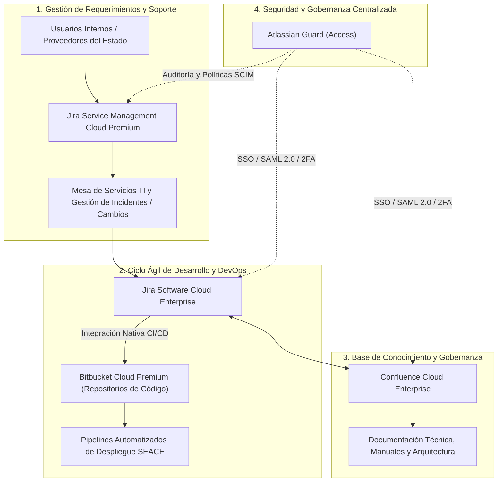

# PROPUESTA TÉCNICO-COMERCIAL: SERVICIO DE SUSCRIPCIÓN DE LICENCIAS ATLASSIAN CLOUD ENTERPRISE PARA PRODUCTOS DIGITALES

**Dirigido a:**
**ORGANISMO SUPERVISOR DE LAS CONTRATACIONES DEL ESTADO – OECE / OSCE**
**Atención:**
* Oficina de Tecnologías de la Información (OTI)
* Unidad de Abastecimiento / Órgano Encargado de las Contrataciones (OEC)
**Sede Central:** Av. Gregorio Escobedo cdra. 7 s/n, Jesús María, Lima
**Referencia:** Proceso CP-ABR-8-2025-OECE-1 (Ciclo de Renovación Proyectada: Septiembre 2026)
**Monto Referencial Estimado:** **S/ 691,592.55**
**Plazo de Anticipación:** **5 Días** (Fase Inminente de Indagación de Mercado y Términos de Referencia)
**Remitente:** Qubits Technology / Senior Key Account Manager Sector Gobierno

---

## 1. RESUMEN EJECUTIVO Y ANÁLISIS ESTRATÉGICO DE LA CUENTA

El Organismo Supervisor de las Contrataciones del Estado (OECE) gestiona el ciclo de vida de desarrollo de software y soporte operativo de sus plataformas de misión crítica para el país (entre ellas el Sistema Electrónico de Contrataciones del Estado - SEACE, el Registro Nacional de Proveedores - RNP, el Tribunal de Contrataciones del Estado y el Observatorio OECE) a través del ecosistema **Atlassian Cloud**.

El contrato vigente (`CP-ABR-8-2025-OECE-1`), adjudicado anteriormente a `PANDORA TECHNOLOGIES E.I.R.L.` por **S/ 691,592.55**, vence en **5 días**. En esta etapa decisiva, la Oficina de Tecnologías de la Información (OTI) consolida el censo de usuarios y la proyección de capacidades para emitir las solicitudes de cotización del Estudio de Mercado.

Qubits Technology presenta una propuesta de suscripción Cloud Enterprise con optimización de licenciamiento por niveles, soporte técnico local especializado con SLA preferencial y servicios de administración delegada para asegurar la continuidad operativa de la plataforma de ingeniería digital del OECE sin interrupciones.

---

## 2. ARQUITECTURA DEL ECOSISTEMA ATLASSIAN PROPUESTO



### Componentes de la Solución de Licenciamiento:
1. **Jira Software Cloud Enterprise / Premium:**
   * Gestión ágil (Scrum, Kanban) para todos los escuadrones de desarrollo y mantenimiento de los sistemas del OECE.
   * Capacidades avanzadas de planificación de proyectos (*Advanced Roadmaps*), dependencias entre equipos y reportes de velocidad.
   * Almacenamiento ilimitado y Acuerdo de Nivel de Servicio (SLA) de disponibilidad del 99.95% respaldado por Atlassian.
2. **Jira Service Management (JSM) Cloud Premium:**
   * Mesa de ayuda de TI según buenas prácticas ITIL (Gestión de Incidentes, Problemas, Cambios y Solicitudes de Servicio).
   * Gestión de activos y configuración (*Assets / Insight*) para inventariar componentes de software y servidores del OECE.
   * Portales de atención dedicados para usuarios internos del OECE y usuarios de soporte externo.
3. **Confluence Cloud Enterprise:**
   * Espacio colaborativo centralizado para la documentación técnica, diagramas de arquitectura, minutas de comités y manuales de procedimientos.
   * Control estricto de versiones y permisos granulares por gerencia o proyecto.
4. **Bitbucket Cloud Premium:**
   * Repositorios Git empresariales con control de acceso por ramas (*Branch Permissions*), verificación obligatoria de dos pasos (2FA) y revisión de código (*Pull Requests*).
   * Análisis de seguridad estático de código fuente (*Code Insights / Static Security Analysis*).
5. **Atlassian Guard (anteriormente Atlassian Access):**
   * Integración directa con el Directorio Activo de Microsoft / Azure AD del OECE mediante SAML 2.0 y aprovisionamiento automático de usuarios (SCIM).
   * Registro centralizado de auditoría para trazabilidad de accesos y seguridad informática.

---

## 3. DIFERENCIALES COMPETITIVOS FRENTE AL INCUMBENTE

| Factor Clave | Proveedor Tradicional (Pandora Technologies) | Propuesta de Valor Qubits |
| :--- | :--- | :--- |
| **Acompañamiento Técnico** | Reventa básica de licencias con soporte en inglés del fabricante | **Especialistas Atlassian locales en Lima asignados a la OTI-OECE** |
| **SLA de Atención ante Caídas** | Mejor esfuerzo (8 a 24 horas) | **SLA garantizado < 1 hora para incidencias críticas (Severidad 1)** |
| **Optimización de Tiers** | Cobro por tramos fijos estándar sin depuración de cuentas | **Auditoría trimestral de cuentas inactivas para optimizar costos de renovación** |
| **Transferencia Tecnológica** | No incluida o con costo adicional | **40 horas anuales de consultoría y buenas prácticas Jira/JSM incluidas** |
| **Garantía y Respaldos** | Copias básicas estándar | **Procedimientos automatizados de respaldo local y exportación de datos** |

---

## 4. FORMATO DE CARTA FORMAL PARA MESA DE PARTES VIRTUAL OECE / OSCE

```text
CARTA N° 050-2026-QS/KAM-GOBIERNO

Lima, 10 de Septiembre de 2026

Señores:
ORGANISMO SUPERVISOR DE LAS CONTRATACIONES DEL ESTADO – OECE / OSCE
Atención: Oficina de Tecnologías de la Información (OTI) / Unidad de Abastecimiento
Av. Gregorio Escobedo cdra. 7 s/n, Jesús María, Lima

Asunto: Presentación de Portafolio de Licenciamiento Atlassian Cloud Enterprise y Solicitud de Reunión de Consulta para el Estudio de Mercado de la Renovación de Plataforma de Gestión de Productos Digitales

De nuestra especial consideración:

Reciban un cordial saludo en nombre de QUBITS TECHNOLOGY / QSALES, empresa peruana proveedora de soluciones corporativas de software, infraestructura de TI y consultoría digital para entidades del Sector Público nacional.

Habiendo tomado conocimiento de la próxima renovación del "Servicio de Suscripción de Licencias del Software Atlassian para la Plataforma en la Nube de Gestión de la Implementación, Modificación y Soporte Operativo de los Productos Digitales del OECE", ponemos a su disposición nuestras capacidades como canal autorizado con personal certificado en el ecosistema Atlassian.

Nuestra oferta garantiza:
1. Aprovisionamiento directo de licencias Atlassian Cloud Enterprise (Jira Software, Jira Service Management, Confluence, Bitbucket y Atlassian Guard) con las mejores condiciones comerciales del canal mayorista oficial.
2. Soporte técnico local en Lima de Nivel 2 y Nivel 3 con tiempos de respuesta de hasta 1 hora para incidentes de alta prioridad.
3. Bolsa de horas de acompañamiento técnico para administración de la instancia, optimización de workflows, reglas de automatización y gobernanza de accesos.

Con el fin de brindar información técnica y comercial precisa para la etapa de indagación de mercado y definición de las Especificaciones Técnicas correspondientes, solicitamos una REUNIÓN TÉCNICA DE CONSULTA con el equipo de la OTI.

Agradeciendo por anticipado su gentil deferencia, quedamos atentos a sus indicaciones para remitir la estructura formal de cotización.

Atentamente,

____________________________________________
Alexander Cerna Rivas
Senior Key Account Manager – Sector Gobierno
QUBITS SALES / QUBITS TECHNOLOGY
Email: alexander.cerna@qubitssales.com / acernar@gmail.com
Celular: (+51) 9XX-XXX-XXX
```

---

## 5. CRONOGRAMA DE EJECUCIÓN INMEDIATA (5 DÍAS)

| Día | Acción Táctica | Responsable |
| :--- | :--- | :--- |
| **Día 1 (Hoy)** | Presentación de Carta N° 050-2026-QS en Mesa de Partes Digital del OECE | Senior KAM |
| **Día 2** | Contacto telefónico y coordinación con la Jefatura de Tecnologías del OECE | Senior KAM |
| **Día 3** | Envío de estructura de precios y matriz de licenciamiento para el Estudio de Mercado | Especialista Comercial + Mayorista |
| **Día 4** | Reunión técnica de aclaraciones y alineamiento de SLAs requeridos | Arquitecto DevOps / KAM |
| **Día 5** | Monitoreo de publicación de convocatoria en el SEACE | Motor Daemon KAM Intelligence |

---
*Documento estratégico generado por KAM Intelligence · Motor Predictivo SEACE v2.6.4*
