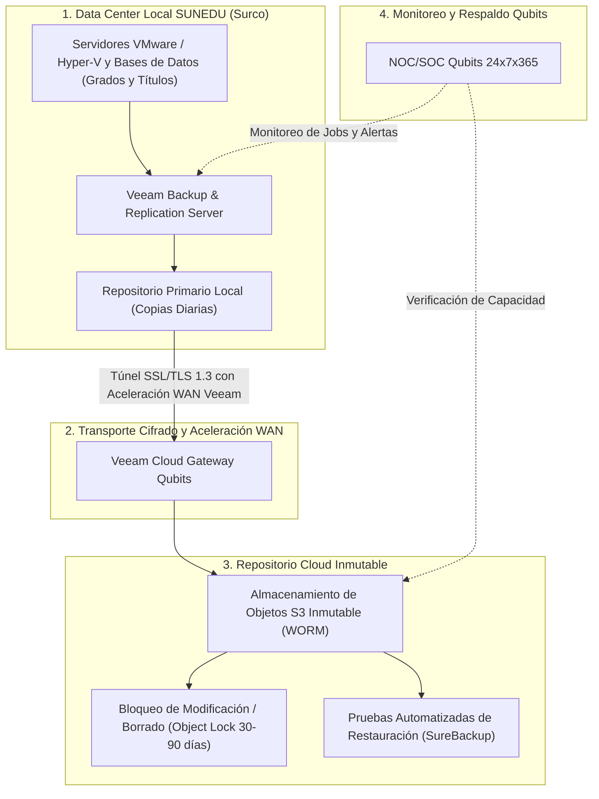

# PROPUESTA TÉCNICO-COMERCIAL: ALMACENAMIENTO DE COPIAS DE RESPALDO EN NUBE E INMUTABILIDAD CONTRA RANSOMWARE (VEEAM CLOUD CONNECT)

**Dirigido a:**
**SUPERINTENDENCIA NACIONAL DE EDUCACIÓN SUPERIOR UNIVERSITARIA – SUNEDU**
**Atención:**
* Oficina de Tecnologías de la Información (OTI)
* Unidad de Abastecimiento / Órgano Encargado de las Contrataciones
**Sede Central:** Calle Aldabas N° 337, Urb. Las Gardenias, Santiago de Surco, Lima
**Referencia:** Proceso CP SER-SM-1-2026-SUNEDU-1 / AS-SM-4-2024-SUNEDU-1
**Monto Referencial Estimado:** **S/ 231,367.77**
**Plazo de Anticipación:** **35 Días** (Fase de Formulación de EETT y Estudio de Mercado)
**Remitente:** Qubits Technology / Senior Key Account Manager Sector Gobierno

---

## 1. RESUMEN EJECUTIVO Y OBJETIVO ESTRATÉGICO

La Superintendencia Nacional de Educación Superior Universitaria (SUNEDU) custodia los registros y sistemas informáticos de mayor valor para la comunidad académica del país: el Registro Nacional de Grados y Títulos, el Sistema de Información Universitaria (SIU) y los expedientes digitales de licenciamiento y supervisión institucional.

Garantizar la protección contra desastres físicos, fallas lógicas y ataques dirigidos de secuestro de datos (*ransomware*) requiere que las copias de seguridad de SUNEDU se alojen en una nube pública segura con capacidades de **inmutabilidad estricta (WORM / Object Lock)** y compatibilidad nativa con su infraestructura de respaldo corporativo **Veeam Backup & Replication**.

Con un presupuesto estimado de **S/ 231,367.77** y un horizonte de renovación proyectado a **35 días**, Qubits Technology pone a disposición de la OTI de SUNEDU una solución llave en mano basada en **Veeam Cloud Connect**, almacenamiento de objetos georredundante y canal de datos cifrado sin cargos ocultos por transferencia de descarga (*egress traffic*).

---

## 2. ARQUITECTURA TÉCNICA DEL REPOSITORIO DE RESPALDO EN NUBE



### Características Técnicas Destacadas:
1. **Inmutabilidad contra Ransomware (Regla 3-2-1-1-0):**
   * Configuración de *S3 Object Lock* en modo *Compliance* (Cumplimiento): ni administradores internos ni atacantes pueden alterar, cifrar o eliminar las copias durante el período de retención definido por SUNEDU.
2. **Integración Transparente con Veeam Backup:**
   * Conexión directa mediante *Veeam Cloud Connect Repository* sin necesidad de túneles VPN dedicados ni reconfiguración compleja de infraestructura.
   * Aceleración WAN integrada para optimizar el ancho de banda nocturno y reducir ventanas de copia.
3. **Soberanía y Cifrado Extremo a Extremo:**
   * Cifrado AES-256 en origen antes de que los datos salgan del centro de datos de SUNEDU. Las llaves criptográficas permanecen bajo custodia exclusiva de la entidad.
4. **Pruebas Periódicas de Recuperación ante Desastres (DR):**
   * Simulacros semestrales de restauración granular de máquinas virtuales y bases de datos relacionales para certificar el RTO (Recovery Time Objective) inferior a 2 horas.

---

## 3. FORMATO DE CARTA FORMAL PARA MESA DE PARTES SUNEDU

```text
CARTA N° 053-2026-QS/KAM-GOBIERNO

Lima, 10 de Septiembre de 2026

Señores:
SUPERINTENDENCIA NACIONAL DE EDUCACIÓN SUPERIOR UNIVERSITARIA – SUNEDU
Atención: Oficina de Tecnologías de la Información (OTI) / Unidad de Abastecimiento
Calle Aldabas N° 337, Urb. Las Gardenias, Santiago de Surco, Lima

Asunto: Presentación de Capacidades Técnicas, Arquitectura de Respaldo Inmutable en la Nube y Solicitud de Reunión de Consulta para el Estudio de Mercado del Servicio de Almacenamiento de Copias de Respaldo

De nuestra mayor consideración:

Es muy grato saludarlos cordialmente en nombre de QUBITS TECHNOLOGY / QSALES, empresa proveedora de soluciones de computación en la nube, ciberdefensa y continuidad operativa para entidades del Sector Público.

Tomando en consideración la vital importancia que reviste la preservación del Registro Nacional de Grados y Títulos y las plataformas informáticas universitarias, y con miras a la próxima renovación del "Servicio de Almacenamiento de Copias de Respaldo en Nube para la SUNEDU", ponemos a su disposición nuestra infraestructura de repositorio en nube certificada Veeam Cloud Connect.

Nuestra solución ofrece a SUNEDU:
1. Repositorio de almacenamiento de objetos inmutable (Object Lock WORM) resistente a ataques de ransomware avanzados y amenazas internas.
2. Enlace de transferencia optimizado con aceleración WAN y cero costos variables por egress traffic o solicitudes de lectura/escritura (API calls).
3. Acompañamiento técnico de ingenieros certificados Veeam (VMCE) y soporte local en Lima 24x7x365 con SLA garantizado.

Con el objeto de brindar especificaciones actualizadas y cotizaciones referenciales para su Estudio de Mercado, solicitamos una REUNIÓN TÉCNICA DE CONSULTA (presencial o virtual), así como la habilitación de un repositorio de prueba (POC de 10 TB sin costo por 30 días).

Agradeciendo la atención brindada a la presente, quedamos a sus gratas órdenes.

Atentamente,

____________________________________________
Alexander Cerna Rivas
Senior Key Account Manager – Sector Público
QUBITS SALES / QUBITS TECHNOLOGY
Email: alexander.cerna@qubitssales.com / acernar@gmail.com
Celular: (+51) 9XX-XXX-XXX
```

---
*Documento estratégico generado por KAM Intelligence · Motor Predictivo SEACE v2.6.4*
