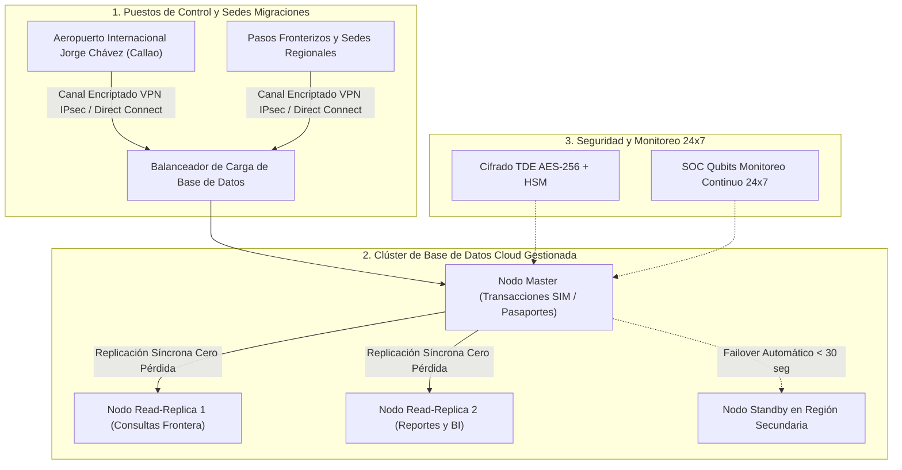

# PROPUESTA TÉCNICO-COMERCIAL: SERVICIO DE BASE DE DATOS Y COLABORACIÓN EN LA NUBE DE ALTA DISPONIBILIDAD PARA EL CONTROL MIGRATORIO

**Dirigido a:**
**SUPERINTENDENCIA NACIONAL DE MIGRACIONES – MIGRACIONES**
**Atención:**
* Oficina de Tecnologías de Información y Comunicaciones (OTIC)
* Unidad de Abastecimiento / Órgano Encargado de las Contrataciones
**Sede Central:** Av. España N° 734, Breña, Lima
**Referencia:** Reactivación de Procedimiento Desierto (Servicio de Base de Datos en la Nube) y Suscripciones Cloud
**Remitente:** Qubits Technology / Senior Key Account Manager Sector Gobierno

---

## 1. RESUMEN EJECUTIVO Y OPORTUNIDAD COMERCIAL

La Superintendencia Nacional de Migraciones opera servicios críticos para la seguridad nacional y el libre tránsito internacional: el control fronterizo en puertos, aeropuertos (nuevo Aeropuerto Jorge Chávez) y pasos de frontera terrestres, así como el Sistema Integrado de Migraciones (SIM) y la emisión de pasaportes electrónicos.

Habiéndose identificado que el procedimiento de contratación para el **Servicio de Base de Datos en la Nube** quedó en condición de **DESIERTO**, la OTIC de Migraciones requiere de forma urgente alternativas técnicas sólidas que permitan reactivar el requerimiento, ajustar las especificaciones y asegurar la continuidad operativa de sus repositorios de datos sin riesgo de interrupción.

Qubits Technology pone a disposición de Migraciones un servicio administrado de Base de Datos Relacional y NoSQL en Nube (PostgreSQL / Oracle / MySQL / Redis) con replicación geográfica activa-activa, baja latencia para puestos de control fronterizo y cumplimiento estricto del marco de ciberseguridad nacional.

---

## 2. ARQUITECTURA CLOUD DE ALTA DISPONIBILIDAD PROPUESTA



### Diferenciales Técnicos:
1. **Rendimiento y Latencia para Control Fronterizo:**
   * Almacenamiento NVMe de ultra baja latencia (< 1 ms) capaz de responder a consultas de antecedentes e impedimentos de salida en menos de 200 milisegundos por pasajero.
2. **Alta Disponibilidad con Failover Automático:**
   * Arquitectura multi-zona (Multi-AZ) con conmutación automática ante contingencias (*Failover*) en menos de 30 segundos sin intervención manual.
3. **Copia de Seguridad Continua a Punto en el Tiempo (PITR):**
   * Respaldos continuos de transacciones (WAL logs) que permiten restaurar la base de datos a cualquier segundo exacto de los últimos 35 días.

---

## 3. FORMATO DE CARTA FORMAL PARA MESA DE PARTES MIGRACIONES

```text
CARTA N° 055-2026-QS/KAM-GOBIERNO

Lima, 10 de Septiembre de 2026

Señores:
SUPERINTENDENCIA NACIONAL DE MIGRACIONES
Atención: Oficina de Tecnologías de Información y Comunicaciones (OTIC) / Unidad de Abastecimiento
Av. España N° 734, Breña, Lima

Asunto: Presentación de Alternativas de Arquitectura Cloud de Base de Datos de Alta Disponibilidad y Solicitud de Reunión Técnica para la Reactivación de Servicio Desierto

De nuestra consideración:

Es grato saludarlos cordialmente en nombre de QUBITS TECHNOLOGY / QSALES, empresa especializada en soluciones de computación en la nube, ciberseguridad y bases de datos de misión crítica para el Sector Público.

Conocedores de la alta exigencia de procesamiento transaccional que demanda el Sistema Integrado de Migraciones (SIM) y la gestión del flujo migratorio nacional, y habiendo tomado conocimiento del estado del procedimiento de contratación del "Servicio de Base de Datos en la Nube", ponemos a disposición de su despacho nuestro equipo de Arquitectos de Datos Certificados.

Nuestra solución ofrece a Migraciones:
1. Despliegue de clústeres de base de datos en nube con disponibilidad del 99.99%, escalabilidad elástica para absorber picos en temporadas altas y conmutación automática por contingencia.
2. Migración transparente de esquemas y datos sin ventana de parada en los puestos de control fronterizo.
3. Soporte técnico especializado de Nivel 2 y Nivel 3 con base operativa en Lima y guardia activa 24x7x365.

Con el objetivo de contribuir al ajuste técnico de los Términos de Referencia que permitan relanzar exitosamente la convocatoria, solicitamos una REUNIÓN TÉCNICA DE CONSULTA con el equipo de la OTIC. Asimismo, ofrecemos una prueba de concepto (POC) sin costo para validar el rendimiento transaccional.

Sin otro particular, agradecemos la atención a la presente y quedamos a su entera disposición.

Atentamente,

____________________________________________
Alexander Cerna Rivas
Senior Key Account Manager – Sector Público
QUBITS SALES / QUBITS TECHNOLOGY
Email: alexander.cerna@qubitssales.com / acernar@gmail.com
Celular: (+51) 9XX-XXX-XXX
```

---
*Documento estratégico de rescate de procesos desiertos · KAM Intelligence v2.6.4*
