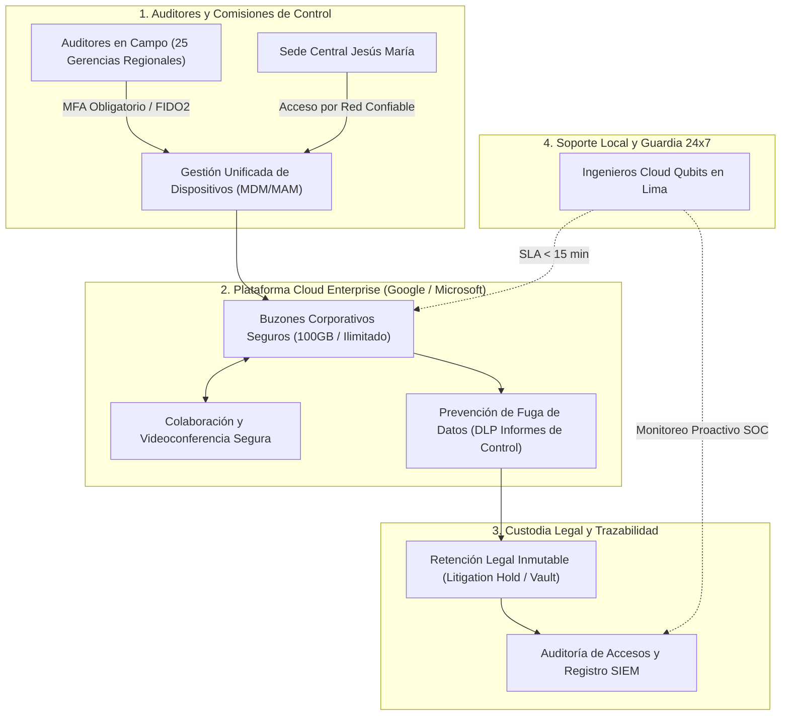

# PROPUESTA TÉCNICO-COMERCIAL: PLATAFORMA DE CORREO ELECTRÓNICO, COLABORACIÓN Y SEGURIDAD EN LA NUBE PARA EL SISTEMA NACIONAL DE CONTROL

**Dirigido a:**
**CONTRALORÍA GENERAL DE LA REPÚBLICA – CGR**
**Atención:**
* Gerencia de Tecnologías de la Información (GTI)
* Subgerencia de Abastecimiento / Órgano Encargado de las Contrataciones
**Sede Central:** Jr. Camilo Carrillo N° 114, Jesús María, Lima
**Referencia:** Proceso CP SER-SM-1-2025-C.G.R.-1 / CP SER-SM-1-2026-C.G.R.-1
**Ciclo de Renovación Proyectada:** Octubre 2026
**Monto Referencial Estimado:** **S/ 8,890,000.00**
**Plazo de Anticipación:** **36 Días** (Ventana de Oro: Formulación de Requerimiento y TDR)
**Remitente:** Qubits Technology / Senior Key Account Manager Sector Gobierno

---

## 1. RESUMEN EJECUTIVO Y OBJETIVO ESTRATÉGICO

La Contraloría General de la República (CGR) lidera el Sistema Nacional de Control y requiere una plataforma de correo electrónico, almacenamiento y herramientas colaborativas de máxima confidencialidad para sus más de 5,000 auditores, especialistas y comisiones de control distribuidas en las 25 Gerencias Regionales a nivel nacional.

La emisión, custodia y trazabilidad de los Informes de Control Previo, Concurrente y Posterior, así como las carpetas fiscales derivadas, exigen una infraestructura en la nube con los más altos estándares de cifrado, prevención de fuga de información (DLP) y gestión unificada de dispositivos móviles (MDM/MAM).

Con un valor referencial histórico de **S/ 8,890,000.00**, disputado históricamente entre `SEIDOR TECHNOLOGIES PERU S.A.C.` y `XERTICA LABS S.A.C.`, el ciclo de contratación entra en su **ventana de 36 días**. Este es el momento decisivo para que el área usuaria (GTI) reciba alternativas de arquitectura técnica que eleven las exigencias de ciberseguridad y soporte local, posicionando a Qubits Technology como el socio tecnológico estratégico del Estado.

---

## 2. ARQUITECTURA DE CIBERSEGURIDAD Y COLABORACIÓN PROPUESTA



### Especificaciones Técnicas Clave para el TDR:
1. **Confidencialidad y Prevención de Fuga de Datos (DLP Avanzado):**
   * Reglas automáticas de DLP para detectar y bloquear la salida no autorizada de archivos con marcas de agua de "Confidencial", números de DNI, cuentas bancarias, declaraciones juradas de ingresos y bienes, o proyectos de informes de auditoría.
   * Cifrado en reposo con gestión de llaves del cliente (*Customer-Managed Encryption Keys - CMEK*) para garantizar que la entidad mantenga la soberanía total de la información ante cualquier tercero.
2. **Custodia Legal Inmutable y eDiscovery:**
   * Archivo legal inalterable (*Vault / Litigation Hold*) con retención garantizada por 10 años para cumplir con el marco de control gubernamental y responder a solicitudes de la Fiscalía de la Nación y el Poder Judicial.
   * Búsqueda forense instantánea a través de millones de buzones, chats y documentos en segundos con preservación de la cadena de custodia digital.
3. **Gestión de Dispositivos Móviles para Comisiones Regionales (MDM):**
   * Borrado remoto selectivo de buzones y carpetas institucionales en caso de pérdida, sustracción o desvinculación de inspectores en comisión de servicio.
   * Contenedor seguro empresarial que separa los datos de auditoría de los datos personales en dispositivos móviles iOS y Android.
4. **Acuerdo de Nivel de Servicio (SLA) y Continuidad Operativa:**
   * SLA de disponibilidad del 99.9% financiero y contractualmente garantizado.
   * Respaldo georredundante en centros de datos con certificaciones Tier III / Tier IV e ISO 27001 / ISO 27701.

---

## 3. DIFERENCIALES FRENTE A LOS INCUMBENTES (SEIDOR / XERTICA)

| Factor Evaluado | Incumbentes Tradicionales (Seidor / Xertica) | Propuesta Estratégica Qubits |
| :--- | :--- | :--- |
| **Soporte Técnico Especializado** | Mesa de ayuda remota generalista con escalamiento a fábrica | **Equipo de ingenieros Cloud y Ciberseguridad dedicados en Lima con SLA < 15 min** |
| **Monitoreo SOC y Fuga de Información** | Alertamiento básico en consola de administración | **Integración directa con SOC Qubits 24x7 para detección activa de anomalías** |
| **Optimización de Costos de Licenciamiento** | Facturación lineal por paquete sin análisis de uso | **Gobernanza activa de licencias con perfilado de usuarios (Buzón ligero vs. Auditor avanzado)** |
| **Capacitación Técnica Certificada** | Sesiones masivas de usuario final | **Plan anual de formación y certificación oficial para 15 ingenieros de la GTI de la CGR** |
| **Acompañamiento en Migración** | Guías y soporte básico de transferencia | **Fábrica de migración automatizada con verificación de integridad hash al 100%** |

---

## 4. FORMATO DE CARTA FORMAL PARA MESA DE PARTES VIRTUAL CGR

```text
CARTA N° 052-2026-QS/KAM-GOBIERNO

Lima, 10 de Septiembre de 2026

Señores:
CONTRALORÍA GENERAL DE LA REPÚBLICA – CGR
Atención: Gerencia de Tecnologías de la Información (GTI) / Subgerencia de Abastecimiento
Jr. Camilo Carrillo N° 114, Jesús María, Lima

Asunto: Presentación de Capacidades Técnicas, Arquitectura de Colaboración Cloud Segura y Solicitud de Reunión de Asesoría Técnica para el Estudio de Mercado de la Plataforma de Correo y Herramientas Colaborativas en la Nube

De nuestra distinguida consideración:

Es muy grato saludarlos cordialmente en representación de QUBITS TECHNOLOGY / QSALES, empresa peruana proveedora de soluciones de computación en la nube de alta disponibilidad, infraestructura crítica y ciberseguridad para organismos de control y tutela del Estado.

Tomando en cuenta la magnitud y trascendencia de la labor fiscalizadora que ejerce la Contraloría General de la República en todo el territorio nacional, y con miras al próximo ciclo de renovación del "Servicio de Plataforma de Correo Electrónico y Herramientas Colaborativas en la Nube", ponemos a disposición de su despacho nuestro equipo de Arquitectos Cloud Senior.

Nuestra propuesta se enfoca en resolver los desafíos de seguridad más sensibles de la CGR:
1. Protección inquebrantable de los Informes de Control mediante políticas avanzadas de Prevención de Pérdida de Datos (DLP) y custodia legal inmutable (Litigation Hold).
2. Seguridad perimetral y gestión de dispositivos móviles (MDM) para garantizar la integridad operativa de los auditores en las 25 Gerencias Regionales de Control.
3. Mesa de ayuda y soporte técnico especializado de Nivel 2 y Nivel 3 con base operativa en Lima y atención prioritaria 24x7x365.

Con la finalidad de colaborar constructivamente en la fase de formulación de requerimientos y poner a su alcance estructuras de costos actualizadas para el correspondiente Estudio de Mercado, solicitamos una REUNIÓN TÉCNICA DE CONSULTA (presencial en su sede central o por videoconferencia).

Agradeciendo por anticipado la gentileza de su atención, quedamos a su entera disposición.

Atentamente,

____________________________________________
Alexander Cerna Rivas
Senior Key Account Manager – Sector Gobierno
QUBITS SALES / QUBITS TECHNOLOGY
Email: alexander.cerna@qubitssales.com / acernar@gmail.com
Celular: (+51) 9XX-XXX-XXX
```

---

## 5. PLAN TÁCTICO PARA LA VENTANA DE 36 DÍAS

| Período | Hito Estratégico | Objetivo Comercial |
| :--- | :--- | :--- |
| **Día 1 – 5** | Ingreso formal de Carta N° 052-2026-QS por Mesa de Partes Virtual CGR | Establecer presencia formal en la GTI |
| **Día 6 – 12** | Reunión técnica de prospección con la Jefatura de Infraestructura y Redes | Presentar arquitectura de DLP y gestión de dispositivos para auditores |
| **Día 13 – 20** | Demostración práctica (PoC) de políticas de seguridad y bóveda legal | Validar funcionalidades críticas con el equipo de la CGR |
| **Día 21 – 28** | Remisión de estructura detallada de cotización para el Estudio de Mercado | Fijar referencia técnica y económica de alta competitividad |
| **Día 29 – 36** | Seguimiento a la aprobación del Expediente de Contratación y PAC | Preparar consorcio / líneas de financiamiento mayorista |

---
*Documento estratégico generado por KAM Intelligence · Motor Predictivo SEACE v2.6.4*
