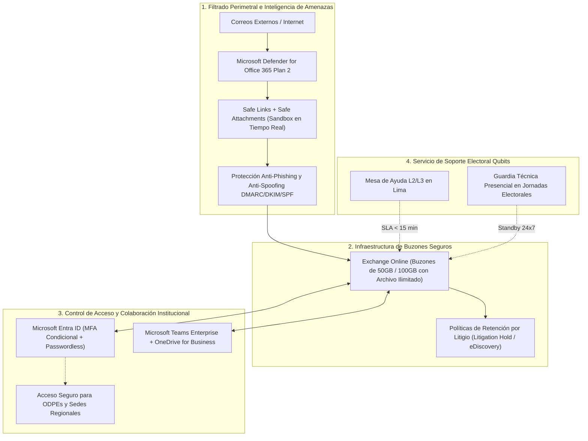

# PROPUESTA TÉCNICO-COMERCIAL: SERVICIO DE CORREO ELECTRÓNICO Y COLABORACIÓN EN LA NUBE DE MISIÓN CRÍTICA (MICROSOFT 365 / DEFENDER)

**Dirigido a:**
**OFICINA NACIONAL DE PROCESOS ELECTORALES – ONPE**
**Atención:**
* Gerencia de Informática y Estadística Electoral (GIEE)
* Subgerencia de Operaciones Informáticas
* Oficina de Logística / Área de Abastecimiento
**Sede Central:** Jr. Washington N° 1894, Cercado de Lima
**Referencia:** Proceso CP SER-SM-2-2025-FUNC-ONPE-1 / EG 2026 (Ciclo de Renovación Proyectada: Septiembre 2026)
**Monto Referencial Estimado:** **S/ 777,000.00**
**Plazo de Anticipación:** **21 Días** (Ventana Clave de Estudio de Mercado y Determinación del Valor Referencial)
**Remitente:** Qubits Technology / Senior Key Account Manager Sector Gobierno

---

## 1. RESUMEN EJECUTIVO Y ANÁLISIS ESTRATÉGICO DE LA CUENTA

La Oficina Nacional de Procesos Electorales (ONPE) tiene bajo su responsabilidad la planificación, organización y ejecución de los procesos electorales de la República del Perú. Su plataforma de mensajería corporativa y colaboración en la nube constituye un activo de seguridad nacional, demandando una disponibilidad del 99.99%, protección extrema contra campañas de phishing, suplantación de identidad (*spoofing*) y exfiltración de información electoral sensible.

En los últimos períodos, este servicio ha sido adjudicado de forma recurrente al proveedor `DAILY TECHNOLOGY S.A.C.` con un importe de referencia aproximado de **S/ 777,000.00**.

Faltando **21 días** para la renovación del servicio de funcionamiento (FUNC), la GIEE de la ONPE se encuentra en el período óptimo para recibir propuestas técnicas mejoradas que introduzcan mayores garantías de ciberseguridad sin encarecer el presupuesto institucional.

Qubits Technology pone a disposición de la ONPE una propuesta integral basada en el ecosistema **Microsoft 365 Cloud** complementada con el Centro de Operaciones de Seguridad (SOC) de Qubits y una guardia técnica presencial dedicada durante jornadas electorales y simulacros oficiales.

---

## 2. ARQUITECTURA DE SEGURIDAD Y COLABORACIÓN PROPUESTA



### Especificaciones Técnicas Clave:
1. **Capacidad y Disponibilidad de Buzones:**
   * Buzones principales de 50 GB / 100 GB por usuario con espacio de archivado de expansión automática ilimitado.
   * Disponibilidad garantizada de 99.99% respaldada contractualmente con penalidad de SLA.
2. **Ciberseguridad Electoral de Grado Superior:**
   * **Microsoft Defender for Office 365 (Plan 2):** Análisis de enlaces en tiempo de clic (*Safe Links*), detonación de adjuntos maliciosos en sandbox aislada (*Safe Attachments*) y simulación automatizada de ataques para concienciación del personal de la ONPE.
   * Verificación estricta de políticas de autenticación de correo: SPF, DKIM y alineación DMARC en modo rechazo (*p=reject*) para blindar el dominio `@onpe.gob.pe` ante suplantaciones públicas.
3. **Gobierno y Cumplimiento Normativo:**
   * Políticas de retención legal inmutable (*Litigation Hold*) y herramientas de búsqueda y auditoría avanzada (*eDiscovery*) para trazabilidad de resoluciones y actos administrativos electorales.
   * Prevención de Pérdida de Datos (DLP) configurada para bloquear el envío no autorizado de números de DNI, padrones o actas electorales reservadas.
4. **Acceso Condicional para ODPEs (Oficinas Descentralizadas):**
   * Políticas de autenticación multifactor (MFA) obligatoria adaptadas a conexiones de red desde provincias mediante Microsoft Authenticator o llaves FIDO2.

---

## 3. MATRIZ DIFERENCIAL: QUBITS VS. DAILY TECHNOLOGY S.A.C.

| Criterio Evaluado | Daily Technology S.A.C. (Incumbente) | Propuesta Estratégica Qubits |
| :--- | :--- | :--- |
| **Soporte durante Jornadas Electorales** | Atención remota estándar en horario de oficina | **Equipo técnico presencial en la sede de la ONPE durante simulacros y días de sufragio (24x7)** |
| **Monitoreo de Ciberamenazas** | Notificación estándar por portal Microsoft | **Monitoreo proactivo por SOC Qubits con alerta inmediata ante intentos de infiltración** |
| **Auditoría y Optimización de Licencias** | Facturación fija de licencias asignadas | **Revisión mensual de buzones inactivos o bajas para reasignar y reducir costo de renovación** |
| **SLA de Respuesta ante Caídas** | 4 a 8 horas hábiles | **SLA garantizado de 15 minutos para incidentes críticos** |
| **Capacitación del Personal de la GIEE** | Videos pregrabados de autoservicio | **Talleres presenciales y acreditación oficial Microsoft 365 Security para 8 ingenieros de la GIEE** |

---

## 4. FORMATO DE CARTA FORMAL PARA MESA DE PARTES ONPE

```text
CARTA N° 051-2026-QS/KAM-GOBIERNO

Lima, 10 de Septiembre de 2026

Señores:
OFICINA NACIONAL DE PROCESOS ELECTORALES – ONPE
Atención: Gerencia de Informática y Estadística Electoral (GIEE) / Subgerencia de Operaciones Informáticas
Oficina de Logística / Unidad de Abastecimiento
Jr. Washington N° 1894, Cercado de Lima

Asunto: Presentación de Solución Tecnológica, Estructura de Precios y Solicitud de Reunión Técnica para el Estudio de Mercado de la Renovación del Servicio de Correo Electrónico en la Nube y Ciberseguridad

De nuestra distinguida consideración:

Es un honor dirigirnos a ustedes en nombre de QUBITS TECHNOLOGY / QSALES, empresa especializada en soluciones de computación en la nube, infraestructura crítica y ciberseguridad corporativa para organismos del Estado peruano.

Conscientes de la alta responsabilidad cívica e institucional que asume la ONPE en la custodia y transparencia de los procesos electorales de nuestro país, y ante la próxima renovación del "Servicio de Correo Electrónico en la Nube (Funcionamiento y Procesos Electorales)", ponemos a su disposición nuestra oferta técnica de valor agregado sobre la plataforma Microsoft 365 Enterprise.

Nuestra solución contempla:
1. Suscripción y licenciamiento Microsoft 365 / Exchange Online bajo canal oficial CSP Tier 1, asegurando los precios más competitivos del mercado para optimizar el gasto público.
2. Implementación de capas avanzadas de ciberdefensa mediante Microsoft Defender for Office 365 Plan 2 y configuración integral de protocolos DMARC/DKIM/SPF para máxima protección del dominio @onpe.gob.pe.
3. Compromiso contractual de Guardia Técnica Presencial 24x7 en las sedes centrales de la ONPE durante los simulacros oficiales y la jornada de elecciones generales.
4. Soporte técnico local en Lima con tiempo de respuesta inferior a 15 minutos para incidentes de alta prioridad.

A efectos de coordinar una REUNIÓN TÉCNICA DE CONSULTA y remitir oportunamente nuestra cotización formal para el Estudio de Mercado correspondiente, quedamos a la espera de sus gentiles indicaciones.

Sin otro particular, expresamos a ustedes los sentimientos de nuestra más alta consideración y estima.

Atentamente,

____________________________________________
Alexander Cerna Rivas
Senior Key Account Manager – Sector Público
QUBITS SALES / QUBITS TECHNOLOGY
Email: alexander.cerna@qubitssales.com / acernar@gmail.com
Celular: (+51) 9XX-XXX-XXX
```

---

## 5. CRONOGRAMA TÁCTICO DE SEGUIMIENTO (21 DÍAS)

| Período | Actividad Clave | Mecanismo / Responsable |
| :--- | :--- | :--- |
| **Día 1 – 2** | Radicación de Carta N° 051-2026-QS por Mesa de Partes Virtual de la ONPE | Senior KAM |
| **Día 3 – 5** | Contacto telefónico y seguimiento directo con la Jefatura de la GIEE | Senior KAM |
| **Día 6 – 10** | Presentación de la arquitectura de seguridad y entrega de matriz de cotización formal | Arquitecto Cloud + KAM |
| **Día 11 – 15** | Ajuste fino de especificaciones técnicas y soporte en el Estudio de Mercado | Área Comercial Qubits |
| **Día 16 – 21** | Publicación de bases oficiales y convocatoria SEACE | Monitor Automático KAM Intelligence |

---
*Documento estratégico generado por KAM Intelligence · Motor Predictivo SEACE v2.6.4*
