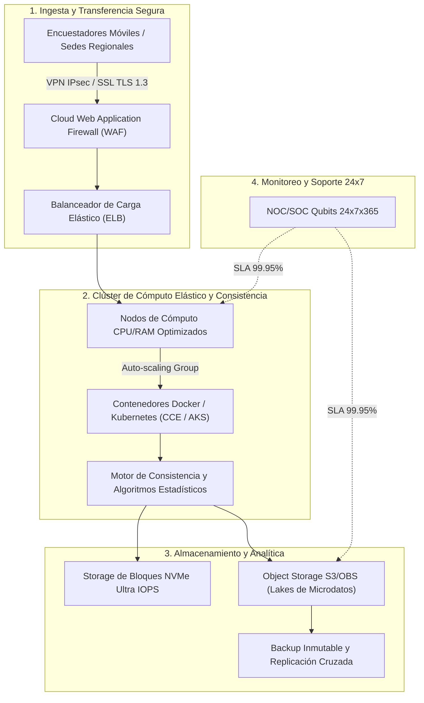

# PROPUESTA TÉCNICO-COMERCIAL: INFRAESTRUCTURA CLOUD DE ALTO RENDIMIENTO PARA PROCESAMIENTO Y CONSISTENCIA DE DATOS ESTADÍSTICOS

**Dirigido a:**
**INSTITUTO NACIONAL DE ESTADÍSTICA E INFORMÁTICA – INEI**
**Atención:**
* Oficina Técnica de Informática (OTI)
* Oficina Técnica de Administración / Unidad de Abastecimiento
**Sede Central:** Av. Gral. Garzón 658, Jesús María, Lima
**Referencia:** Proceso CP SER-SM-11-2025-INEI-1 (Ciclo de Renovación Proyectada: Septiembre 2026)
**Monto Referencial Estimado:** **S/ 995,025.00**
**Plazo de Anticipación:** **6 Días** (Fase Inminente de Indagación de Mercado y Bases)
**Remitente:** Qubits Technology / Senior Key Account Manager Sector Gobierno

---

## 1. RESUMEN EJECUTIVO Y ANÁLISIS DE LA CUENTA

El Instituto Nacional de Estadística e Informática (INEI) requiere infraestructura tecnológica en la nube capaz de procesar grandes volúmenes de registros microdatos, algoritmos de consistencia, validación probabilística y publicación de tabulados para censos y encuestas nacionales continuas (ENAHO, ENDES, Censos Nacionales).

El contrato anterior adjudicado a `ITG SOLUTIONS S.A.C.` por un importe de **S/ 995,025.00** cumple su ciclo operativo proyectado. Al encontrarse a **6 días** de su vencimiento estimado, la OTI del INEI se encuentra en el período de validación técnica del TDR y requerimiento de cotizaciones para el Estudio de Mercado.

Qubits Technology pone a disposición del INEI una arquitectura multicloud IaaS/PaaS optimizada para cómputo intensivo, escalabilidad elástica automatizada y estricto cumplimiento del marco de soberanía y seguridad digital de la Secretaría de Gobierno y Transformación Digital (SGTD - PCM).

---

## 2. ARQUITECTURA TÉCNICA CLOUD PROPUESTA



### Características Principales de la Solución:
1. **Cómputo Elástico para Picos Censales:**
   * Instancias virtuales con procesadores Intel Xeon Scalable / AMD EPYC de última generación.
   * Autoescalado dinámico (*Horizontal Pod Autoscaling*) para absorber picos durante cierres de recolección de campo sin sobredimensionar costos base.
2. **Almacenamiento de Altísima Velocidad:**
   * Discos de estado sólido NVMe dedicados con latencias inferiores a 1 ms y rendimiento de hasta 60,000 IOPS para bases de datos relacionales (PostgreSQL / Oracle).
   * Almacenamiento de objetos con ciclo de vida automatizado (*Hot, Warm, Cold/Glacier*) para optimizar el resguardo histórico de censos anteriores.
3. **Ciberseguridad y Cumplimiento Normativo (SGTD):**
   * Aislamiento en Virtual Private Cloud (VPC) con subredes públicas, privadas y de base de datos no expuestas a Internet.
   * Cifrado en tránsito (TLS 1.3) y en reposo (AES-256) mediante llaves gestionadas por HSM (*Hardware Security Module*).
   * Protección anti-DDoS avanzada mitigando ataques volumétricos L3/L4 y L7 en tiempo real.
4. **Respaldo Inmutable y Plan de Continuidad (DRP):**
   * Políticas de snapshot automatizadas con retención inmutable contra ataques de ransomware.
   * RPO ≤ 15 minutos y RTO ≤ 1 hora ante contingencias mayores.

---

## 3. BENEFICIOS Y DIFERENCIALES COMPETITIVOS DE QUBITS

| Criterio Clave | Proveedor Tradicional (Incumbente) | Propuesta Estratégica Qubits |
| :--- | :--- | :--- |
| **Arquitectura de Nube** | Configuración fija IaaS estándar | **Arquitectura híbrida optimizada para Big Data y analítica estadística** |
| **Control de Costos de Salida** | Tarificación variable por Gigabyte transferido | **Transferencia de datos local ilimitada o bonificada** |
| **Soporte y Mesa de Ayuda** | Tickets en cola general con respuesta L1 genérica | **Ingeniero Cloud asignado en Lima + SLA de respuesta < 15 min ante incidencias críticas** |
| **Capacitación Técnica Oficial** | Cursos genéricos pregrabados | **Programa oficial de certificación Cloud para 6 ingenieros de la OTI-INEI** |
| **Migración y Despliegue** | Guías de autoservicio | **Acompañamiento integral con equipo de arquitectos certificados sin costo adicional** |

---

## 4. FORMATO DE CARTA FORMAL PARA MESA DE PARTES VIRTUAL INEI

```text
CARTA N° 049-2026-QS/KAM-GOBIERNO

Lima, 10 de Septiembre de 2026

Señores:
INSTITUTO NACIONAL DE ESTADÍSTICA E INFORMÁTICA – INEI
Atención: Oficina Técnica de Informática (OTI) / Oficina Técnica de Administración
Av. General Garzón N° 658, Jesús María, Lima

Asunto: Presentación de Capacidades Técnicas, Arquitectura Cloud de Alta Disponibilidad y Solicitud de Reunión de Indagación de Mercado para la Contratación del Servicio de Infraestructura Tecnológica en la Nube

De nuestra consideración:

Es muy grato saludarlos cordialmente en nombre de QUBITS TECHNOLOGY / QSALES, empresa especializada en soluciones de computación en la nube, infraestructura de misión crítica y ciberseguridad para las principales instituciones del Estado peruano.

Tomando en conocimiento que su institución gestiona plataformas computacionales de alta exigencia para el tratamiento, validación y consistencia de datos censales y encuestas nacionales continuas, y ante la próxima renovación del servicio de infraestructura cloud institucional, ponemos a su disposición nuestro equipo de Arquitectura Cloud Certificado.

Nuestra propuesta integra infraestructura IaaS/PaaS en nube pública con certificaciones internacionales ISO 27001, ISO 27017, ISO 27018 y Tier III/IV, acompañada de servicios de monitoreo proactivo 24x7x365 desde nuestro Centro de Operaciones de Red (NOC) en Lima, garantizando una disponibilidad superior al 99.95% y un soporte técnico especializado en idioma español.

Con el propósito de colaborar activamente en el proceso de formulación de especificaciones técnicas y proporcionar alternativas que maximicen la eficiencia del gasto público conforme a la Ley de Contrataciones del Estado, solicitamos a su despacho una REUNIÓN TÉCNICA DE CONSULTA (presencial o virtual). Asimismo, ponemos a su disposición una suscripción de prueba (POC) con créditos de nube para validación de cargas de trabajo de la OTI.

Sin otro particular, agradecemos la atención que brinden a la presente y quedamos a su entera disposición.

Atentamente,

____________________________________________
Alexander Cerna Rivas
Senior Key Account Manager – Sector Público
QUBITS SALES / QUBITS TECHNOLOGY
Email: alexander.cerna@qubitssales.com / acernar@gmail.com
Celular: (+51) 9XX-XXX-XXX
```

---

## 5. PLAN DE ACCIÓN INMEDIATO (6 DÍAS)

| Día | Hito Operativo | Canal / Mecanismo |
| :--- | :--- | :--- |
| **Día 1 (Hoy)** | Registro de la Carta N° 049-2026-QS en la Mesa de Partes Virtual del INEI | Mesa de Partes Digital INEI |
| **Día 2** | Contacto directo con el Director de la Oficina Técnica de Informática (OTI) | Teléfono / Correo institucional |
| **Día 3 – 4** | Presentación ejecutiva de la arquitectura cloud y entrega de matriz comparativa de costos | Sesión virtual / Reunión presencial |
| **Día 5** | Remisión formal de cotización referencial para el Estudio de Mercado | Correo formal de cotizaciones |
| **Día 6** | Configuración de alerta temprana en el SEACE para monitoreo de publicación de convocatoria | Daemon Automático KAM Intelligence |

---
*Documento estratégico generado por KAM Intelligence · Motor Predictivo SEACE v2.6.4*
