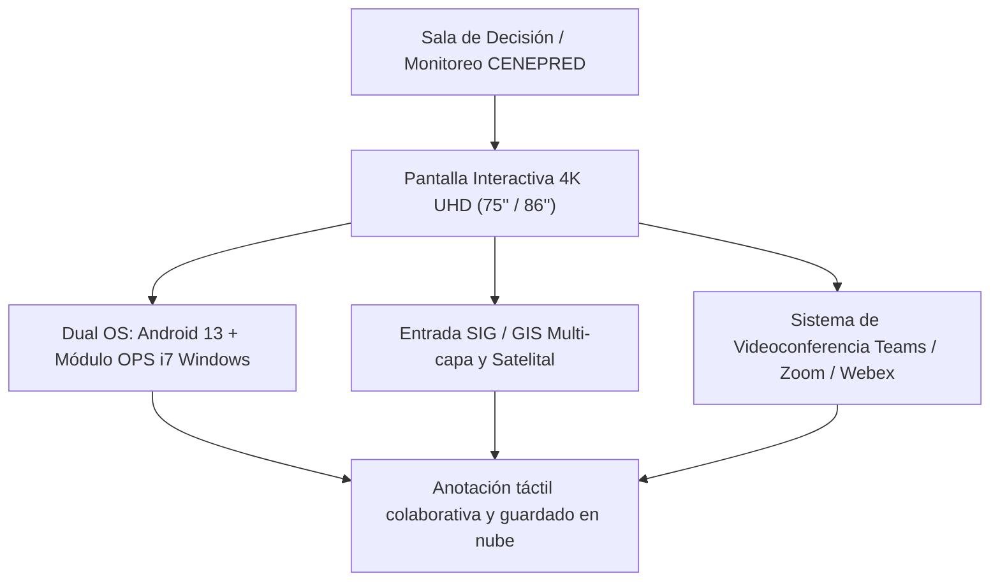

# PROPUESTA TÉCNICO-COMERCIAL: SOLUCIÓN DE PANTALLAS INTERACTIVAS 4K Y SALAS DE MONITOREO DE EMERGENCIAS

**Dirigido a:**
**CENTRO NACIONAL DE ESTIMACIÓN, PREVENCIÓN Y REDUCCION DEL RIESGO DE DESASTRES – CENEPRED**
**Atención:**
* Oficina de Tecnologías de la Información y Comunicación (OTIC)
* Unidad de Abastecimiento / Órgano Encargado de las Contrataciones (OEC)
**Referencia:** Proceso LP-ABR-1-2025-CENEPRED-1 (Ciclo de Renovación Proyectada: Octubre 2026)
**Monto Referencial Estimado:** **S/ 257,441.00**
**Plazo de Anticipación:** **26 Días** (Ventana Crítica de Definición de TDR)
**Remitente:** Qubits Sales / Senior Key Account Manager TI

---

## 1. RESUMEN EJECUTIVO Y OBJETIVO ESTRATÉGICO

CENEPRED, como organismo rector técnico en la gestión prospectiva y correctiva del riesgo de desastres en el Perú, requiere que sus salas de toma de decisiones, comités de emergencia y áreas de análisis de información geoespacial cuenten con plataformas de visualización interactiva de última generación.

La visualización simultánea de capas SIG (Sistemas de Información Geográfica - ArcGIS/QGIS), modelos predictivos de hidrología, geología y sismología, así como la coordinación operativa en tiempo real con ministerios y Centros de Operaciones de Emergencia Regional (COER), demanda pantallas interactivas de gran formato con:
1. **Ultra Alta Definición (4K UHD)** y tecnología antirreflejo de grado industrial.
2. **Capacidad táctil de precisión micrométrica (40 puntos simultáneos)** con soporte multiusuario para anotación directa sobre mapas y ortofotos.
3. **Arquitectura Dual OS (Android empresarial nativo + Módulo OPS Windows 11 Pro i7)** que garantiza compatibilidad nativa con la infraestructura GIS y herramientas de videoconferencia del Estado.
4. **Respaldo y Garantía Oficial de Fábrica (36 meses en sitio)** con soporte técnico especializado de Qubits.

---

## 2. ARQUITECTURA TÉCNICA PROPUESTA: OPCIONES HOMOLOGADAS

Presentamos tres alternativas líderes del mercado mayorista (LOL / NEXUS), completamente adaptadas a las exigencias operativas de CENEPRED:



### Opción 1: Newline Interactive TruTouch Series (Recomendada para salas GIS y técnica colaborativa)
* **Panel:** DLED de 75" / 86" 4K UHD (3840 x 2160 @ 60Hz), tecnología *Optical Bonding* (cero paralelismo, ángulo de visión 178°).
* **Cristal:** Vidrio templado 7H antideslumbrante, antihuellas y antimicrobiano.
* **Precisión Táctil:** Tecnología IR de alta definición con 40 puntos táctiles y reconocimiento inteligente de lápiz, dedo y palma de mano (borrado rápido).
* **Procesamiento Integrado:** Módulo OPS enchufable Intel Core i7 (12th/13th Gen), 16 GB RAM DDR4/DDR5, 512 GB SSD NVMe, Windows 11 Pro preinstalado.
* **Conectividad:** USB-C multifunción (conducción de video 4K, datos, touch y carga PD de 65W con un solo cable), HDMI 2.0 In/Out, LAN Gigabit (RJ45 passthrough), WiFi 6E y Bluetooth 5.2.
* **Colaboración:** Software Newline Cast para compartir pantalla inalámbrica desde hasta 4 dispositivos simultáneos (Windows, Mac, iOS, Android).

### Opción 2: Huawei IdeaHub S2 / Board Pro (Ideal para alta dirección y videoconferencia inteligente)
* **Panel:** Pantalla 4K Soft-light de 75" / 86", frecuencia de refresco optimizada y latencia de escritura ultra baja (16 ms).
* **Cámara & Microfonía Inteligente:** Cámara 4K integrada con encuadre automático por IA (*Auto-Framing*), seguimiento de voz del orador (*Voice Tracking*) y matriz de 8 micrófonos con radio de captación de 12 metros y cancelación de eco y ruido acústico.
* **Doble Sistema:** HarmonyOS empresarial integrado + Módulo OPS Windows opcional con conmutación instantánea de 1 toque.
* **Seguridad:** Cifrado de nivel empresarial y certificación CC EAL5+ para transmisiones seguras entre entidades públicas.

### Opción 3: ViewSonic ViewBoard Serie IFP50-5 (Estándar educativo e institucional masivo)
* **Panel:** IPS 4K Ultra HD de 75" / 86" con tecnología *Ultra Fine Touch* de 40 puntos.
* **Audio:** Barra de sonido estéreo frontal integrada con subwoofer para claridad acústica en salas de reuniones medianas y grandes.
* **Ecosistema de Software:** Suite myViewBoard Whiteboard con integración directa a Google Drive, Microsoft OneDrive y plataformas gubernamentales.
* **Hardware:** Módulo slot-in PC VPC25/VPC27 con procesador Intel vPro para administración remota IT.

---

## 3. COMPARATIVA TÉCNICA DE RENDIMIENTO

| Característica Clave | Opción 1: Newline TruTouch | Opción 2: Huawei IdeaHub S2 | Opción 3: ViewSonic ViewBoard |
| :--- | :--- | :--- | :--- |
| **Tamaño Recomendado** | 75" o 86" | 75" o 86" | 75" o 86" |
| **Resolución** | 4K UHD (3840 x 2160) | 4K UHD (3840 x 2160) | 4K UHD (3840 x 2160) |
| **Latencia de Escritura** | < 25 ms | **≤ 16 ms (Ultra fluida)** | < 30 ms |
| **Módulo OPS Windows** | Incluido (i7 / 16GB / 512GB) | Módulo OPS Opcional | Incluido (i5/i7 OPS) |
| **Cámara Integrada con IA** | Accesorio 4K dedicado | **Integrada 4K con Auto-Tracking** | Barra opcional VB-CAM |
| **Micrófonos Array** | 8 micrófonos direccionales | **8 micrófonos (12 m alcance)** | 8 micrófonos frontales |
| **Conexión USB-C Todo en Uno** | Sí (Carga 65W + Display + Touch) | Sí (Carga 65W + Display + Touch) | Sí (Carga 65W + Display + Touch) |
| **Garantía y Soporte** | 36 meses en sitio (Qubits/Mayorista) | 36 meses en sitio (Huawei Perú) | 36 meses en sitio (ViewSonic Perú) |

---

## 4. COMPONENTES Y SERVICIOS COMPLEMENTARIOS INCLUIDOS

Para garantizar la disponibilidad operativa inmediata de las 5 unidades requeridas por CENEPRED, la propuesta incluye:

1. **Soportes Móviles de Grado Industrial:**
   * Pedestales metálicos rodantes con freno de seguridad, bandeja porta-laptop/OPS y sistema de gestión oculta de cableado.
   * Regulación de altura manual o motorizada para adaptarse a salas de capacitación o salas de crisis de pie.
2. **Instalación, Cableado y Calibración en Sitio:**
   * Tendido de cableado estructurado blindado Cat 6A / HDMI 2.1 óptico de alta velocidad.
   * Integración a la red LAN de CENEPRED con segmentación de VLAN de seguridad.
3. **Capacitación Técnica y Operativa:**
   * Taller de 8 horas para el equipo de la OTIC (administración de red, despliegue de políticas, gestión de OPS).
   * Taller práctico para usuarios finales (especialistas en gestión de riesgos y análisis cartográfico SIG).
4. **Stock Local y Repuestos en Lima:**
   * Garantía de reposición ante fallas de panel en un plazo máximo de 48 horas hábiles durante los 3 años de vigencia.

---

## 5. FORMATO FORMAL DE CARTA DE PRESENTACIÓN PARA MESA DE PARTES

```text
CARTA N° 048-2026-QS/KAM-GOBIERNO

Lima, 10 de Septiembre de 2026

Señores:
CENTRO NACIONAL DE ESTIMACIÓN, PREVENCIÓN Y REDUCCIÓN DEL RIESGO DE DESASTRES – CENEPRED
Atención: Oficina de Tecnologías de la Información y Comunicación (OTIC) / Unidad de Abastecimiento
Av. Del Parque Norte N° 313-319, San Borja, Lima

Asunto: Presentación de Catálogo Tecnológico, Alternativas de Solución y Solicitud de Demostración Técnica (PoC) para Adquisición de Pantallas Interactivas 4K UHD para Salas de Operaciones y Monitoreo de Riesgos

De nuestra mayor consideración:

Por medio de la presente, nos es grato saludarles cordialmente en representación de QUBITS TECHNOLOGY / QSALES, empresa especializada en soluciones de infraestructura informática, equipamiento colaborativo y telecomunicaciones para entidades del Sector Público.

Tomando en consideración la próxima renovación de equipamiento audiovisual e interactivo de su institución, ponemos a su disposición nuestro portafolio homologado de PANTALLAS INTERACTIVAS 4K UHD (75" y 86") con módulos OPS y compatibilidad nativa con sistemas de información geográfica (GIS/SIG) y plataformas de videoconferencia de alta demanda.

Con la finalidad de coadyuvar a la formulación óptima de las Especificaciones Técnicas y Términos de Referencia, solicitamos a su despacho una REUNIÓN TÉCNICA Y DEMOSTRACIÓN EN SITIO (PoC) sin costo alguno, donde su equipo de especialistas podrá evaluar directamente la fluidez táctil, interoperabilidad con capas satelitales y rendimiento colaborativo en tiempo real de las marcas líderes representadas (Newline, Huawei IdeaHub y ViewSonic).

Agradeciendo de antemano la atención brindada, quedamos a su disposición para coordinar la fecha y hora de la visita técnica.

Atentamente,

____________________________________________
Alexander Cerna Rivas
Senior Key Account Manager – Sector Público
QUBITS SALES / QUBITS TECHNOLOGY
Email: alexander.cerna@qubitssales.com / acernar@gmail.com
Celular: (+51) 9XX-XXX-XXX
```

---

## 6. CRONOGRAMA DE ACCIONES COMERCIALES INMEDIATAS (26 DÍAS)

| Semana | Acción Estratégica | Responsable | Estado |
| :--- | :--- | :--- | :--- |
| **Día 1 – 3** | Ingreso formal de Carta y Catálogo Técnico por Mesa de Partes Virtual de CENEPRED | Senior KAM | Pendiente de envío |
| **Día 4 – 7** | Contacto telefónico y seguimiento con la Jefatura de OTIC de CENEPRED | Senior KAM | Programado |
| **Día 8 – 14** | Ejecución de Demo / PoC en la Sala de Operaciones de CENEPRED con pantalla de muestra | Preventa Técnica + KAM | En coordinación |
| **Día 15 – 21** | Envío de cotización formal referencial para sustento del Estudio de Mercado | Finanzas / KAM | En espera de EETT |
| **Día 22 – 26** | Publicación de bases oficiales / Convocatoria SEACE | Monitoreo Daemon | Automatizado |

---
*Documento estratégico generado por KAM Intelligence · Módulo de Oportunidades SEACE v2.6.4*
