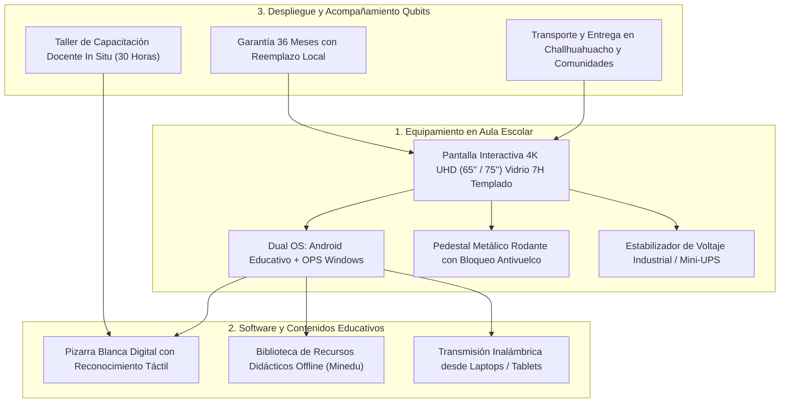

# PROPUESTA TÉCNICO-COMERCIAL: PANTALLAS INTERACTIVAS 4K UHD Y SOLUCIONES DE AULA DIGITAL INTERACTIVA

**Dirigido a:**
**MUNICIPALIDAD DISTRITAL DE CHALLHUAHUACHO (COTABAMBAS, APURÍMAC)**
**Atención:**
* Gerencia de Desarrollo Social / Área de Educación
* Subgerencia de Logística y Abastecimiento
* Unidad de Tecnologías de la Información
**Sede:** Plaza de Armas s/n, Challhuahuacho, Cotabambas, Apurímac
**Referencia:** Proyecto de Inversión Pública (PIP) "Mejoramiento de los Servicios Educativos" / LP-SM-1-2025-CS-MDCH-1
**Monto Referencial Estimado:** **S/ 1,196,800.00**
**Plazo de Planificación:** Ventana Estratégica (86 días al ciclo de renovación/expansión)
**Remitente:** Qubits Technology / Senior Key Account Manager Sector Gobierno

---

## 1. RESUMEN EJECUTIVO Y OBJETIVO DEL PROYECTO

La Municipalidad Distrital de Challhuahuacho, en el marco de sus proyectos de inversión educativa en la zona de influencia minera de Las Bambas, impulsa la modernización pedagógica en instituciones educativas de nivel inicial, primaria y secundaria mediante la implementación de **Aulas Digitales Interactivas**.

El proyecto requiere el suministro, instalación, capacitación y puesta en marcha de un lote masivo de pantallas interactivas de 65", 75" y 86" con tecnología táctil de alta durabilidad, protección contra polvo y fluctuaciones eléctricas en zona de sierra alta (3,700 m.s.n.m.), y software educativo precargado para trabajo sin conexión obligatoria a Internet (*offline*).

Qubits Technology presenta un portafolio de pantallas interactivas de grado educativo (Newline / ViewSonic / Promethean) con módulos OPS Intel Core i5/i7, soporte rodante reforzado de grado escolar y un plan integral de capacitación para los docentes del distrito.

---

## 2. ARQUITECTURA DEL AULA DIGITAL INTERACTIVA PROPUESTA



### Especificaciones Clave de Grado Educativo:
1. **Resistencia y Durabilidad:**
   * Cristal templado de 4 mm con dureza superficial 7H (resistente a impactos escolares, rayaduras y polvo).
   * Panel antideslumbrante (*Anti-Glare*) con filtro de luz azul certificado por TÜV Rheinland para proteger la visión de estudiantes y docentes.
2. **Interactividad Intuitiva:**
   * 40 puntos táctiles simultáneos que permiten a múltiples estudiantes escribir en la pantalla al mismo tiempo.
   * Dos lápices pasivos de doble punta (fina para caligrafía y gruesa para resaltar) sin necesidad de recarga ni baterías.
3. **Módulo OPS Windows con Rendimiento Autónomo:**
   * Procesador Intel Core i5, 16 GB RAM y 512 GB SSD NVMe.
   * Sistema operativo Windows 11 Pro preconfigurado con contenidos pedagógicos alineados al Currículo Nacional del MINEDU.
4. **Logística y Garantía en Apurímac:**
   * Servicio de traslado especializado hasta las instituciones educativas del distrito de Challhuahuacho y comunidades aledañas.
   * Respaldo oficial del fabricante de 36 meses con stock de partes y servicio técnico en la región sur.

---

## 3. FORMATO DE CARTA FORMAL PARA LA MUNICIPALIDAD DE CHALLHUAHUACHO

```text
CARTA N° 056-2026-QS/KAM-GOBIERNO

Lima, 10 de Septiembre de 2026

Señores:
MUNICIPALIDAD DISTRITAL DE CHALLHUAHUACHO
Atención: Gerencia Municipal / Subgerencia de Logística y Abastecimiento / Gerencia de Desarrollo Social
Plaza de Armas s/n, Challhuahuacho, Cotabambas, Apurímac

Asunto: Presentación de Dossier Tecnológico, Alternativas de Equipamiento de Aulas Interactivas 4K y Solicitud de Reunión de Asesoría Técnica para Proyectos de Inversión Educativa

De nuestra mayor consideración:

Reciban un cordial saludo de parte de QUBITS TECHNOLOGY / QSALES, empresa especializada en soluciones de tecnología educativa, infraestructura informática y equipamiento interactivo para el Sector Público nacional.

Habiendo tomado conocimiento del compromiso institucional de su municipalidad con el fortalecimiento de la infraestructura y calidad educativa de las comunidades escolares del distrito de Challhuahuacho, ponemos a su disposición nuestro portafolio de PANTALLAS INTERACTIVAS Y ECOSISTEMAS DE AULA DIGITAL.

Nuestras soluciones garantizan:
1. Pantallas interactivas 4K UHD de marcas líderes mundiales con tecnología de protección de grado escolar y módulo OPS Windows integrado.
2. Soportes metálicos móviles de alta estabilidad, ideales para aulas polivalentes y de innovación pedagógica.
3. Plan integral de capacitación y alfabetización digital in situ para la plana docente del distrito.
4. Cobertura de garantía de 36 meses en sitio con atención directa en la región Apurímac.

Con el fin de brindar información técnica, catálogo de especificaciones y modelos de costos referenciales para la fase de formulación o actualización de expedientes técnicos de contratación, solicitamos una REUNIÓN TÉCNICA DE CONSULTA (presencial o virtual).

Agradeciendo por anticipado su cordial atención, quedamos a su entera disposición.

Atentamente,

____________________________________________
Alexander Cerna Rivas
Senior Key Account Manager – Sector Público
QUBITS SALES / QUBITS TECHNOLOGY
Email: alexander.cerna@qubitssales.com / acernar@gmail.com
Celular: (+51) 9XX-XXX-XXX
```

---
*Documento estratégico generado por KAM Intelligence · Motor Predictivo SEACE v2.6.4*
